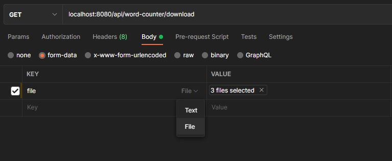

# Word-Counter

Accepts any number of .txt files and calculates the recurrence of each word used throughout the files.

Examples can be found in the test ``` WordCounterServiceTest```

How to use:

* Run the application through your favorite IDE
* An example of how to use the endpoint:

* Port is exposed with the following endpoints:
    * ```GET localhost:8080/api/word-counter/```
    * ```GET localhost:8080/api/word-counter/download```
* The first endpoint shows a list of sorted maps in the following format:
``` 
[
    {
        "Adomas": 5,
        "Bulve": 6,
        "Gandras": 2
    },
    {
        "Henrikas": 4,
        "Jonas": 11,
        "Liuksas": 5,
        "Moneta": 10,
        "Neringa": 11
    },
    {
        "Oras": 7,
        "Uostas": 2
    },
    {
        "Vizija": 10,
        "Zebras": 6
    }
]
```
* The second endpoint let's you view or download a file with the same information in the following format:
```
A to G
Adomas:3
Bulve:4
Gandras:1

H to N
Henrikas:2
Jonas:6
Liuksas:3
Moneta:5
Neringa:6

O to U
Oras:4
Uostas:1

V to Z
Vizija:5
Zebras:4

```